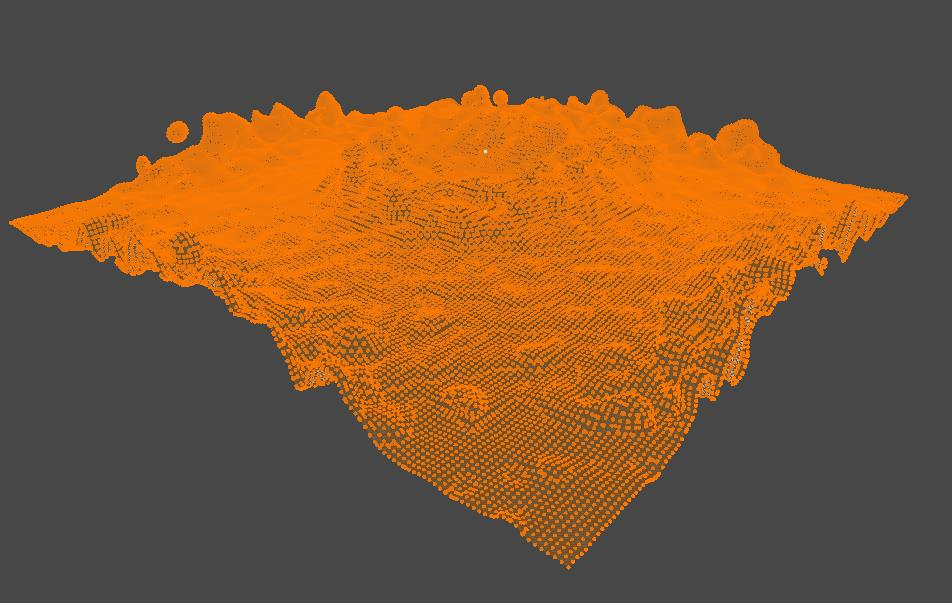

# SPH Fluid

[Smoothed-particle hydrodynamics (SPH)](https://en.wikipedia.org/wiki/Smoothed-particle_hydrodynamics) fluid simulation using CUDA acceleration.

## System Requirements

This program is written in C/C++ and CUDA. A CUDA compatible graphics card is required on Windows with CUDA toolset installed.

To compile the project, you will also need Visual Studio (15 and above).

## Showcase

Real-time particle simulation.

An exported water surface mesh.

A sequence of meshes rendered with external renderer.